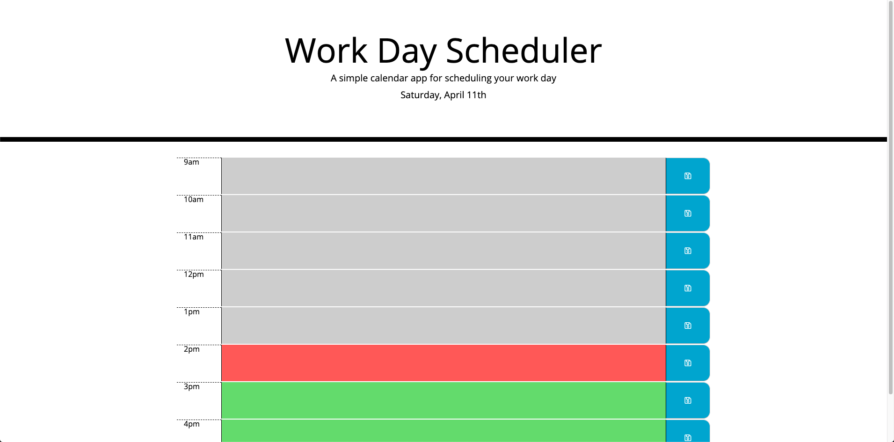

# Daily Task Tracker
A simple task tracker that helps you organize your daily task by the hours of a typical work day (9am-5pm)

To use the Daily Task Tracker, click here: https://ngoudeau2012.github.io/daily_calendar_hw5/

## Description:
Using jQuery, I used to functions to:

1. Set the day of week and date.
2. Get saved tasked local data from storage so that your task don't clear after you leave or refresh the page.
3. Check for validity
4. Set corresponding events to hours
5. Update the time blocks with the schedule data
6. Save that data and
7. Add event listener for save button
8. Change the background of the task area's to identify which time-block you are currently in, if a time-block has passed, or the time-block is later in the day.

## Screenshot of Application:

